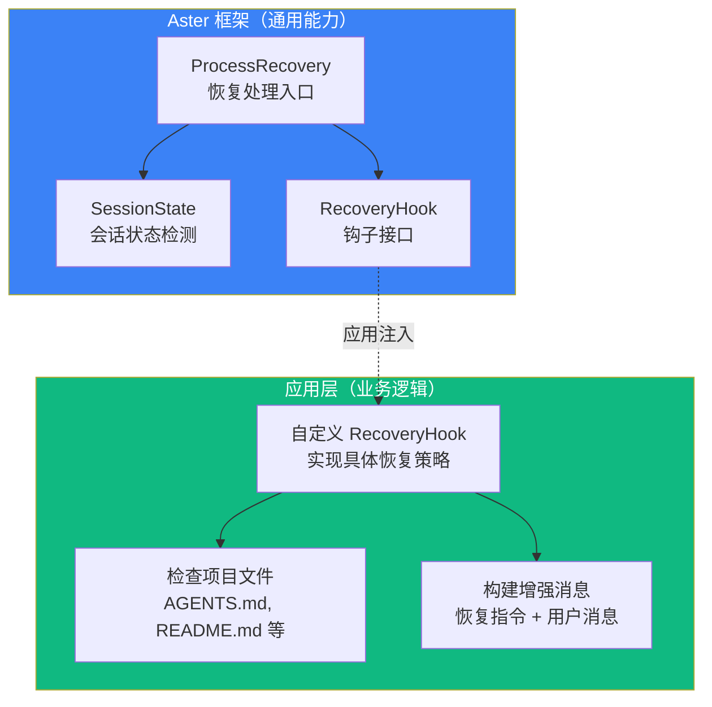
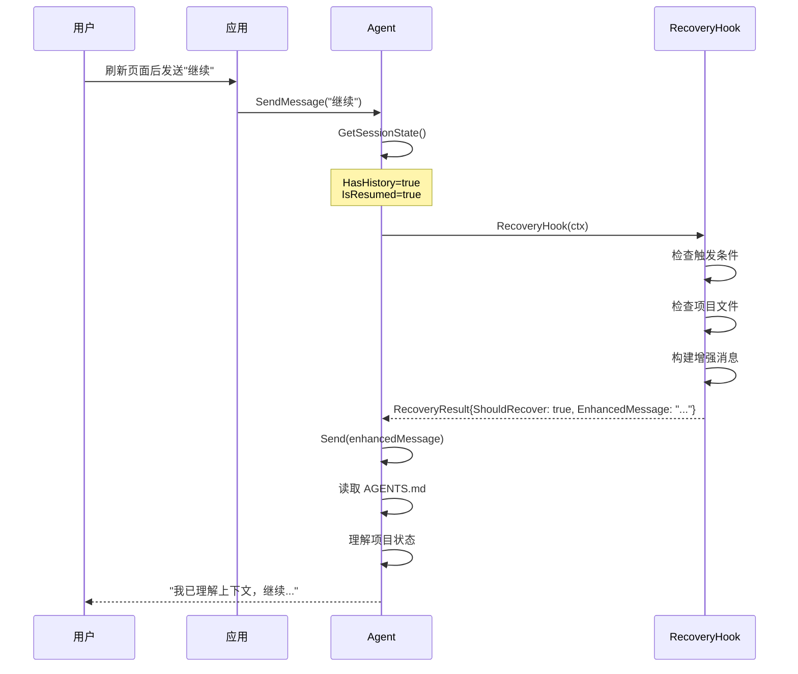

# Session 恢复

Session 恢复是 Aster 框架提供的一个重要特性，允许 Agent 在用户刷新页面或重新进入应用时智能地恢复之前的工作上下文。

## 🎯 问题场景

在实际应用中，用户可能会：

- 刷新浏览器页面
- 关闭浏览器后重新打开
- 切换到其他任务后回来继续

此时 Agent 实例会被重新创建，虽然历史消息被持久化保存，但 Agent 可能不知道：
- 当前工作进行到哪一步了
- 用户之前的需求是什么
- 项目文件的当前状态

## 📐 架构设计

Aster 采用 **框架 + 钩子** 的设计模式：



### 框架与应用的分工

| 层级 | 职责 | 说明 |
|------|------|------|
| **Aster 框架** | 提供基础设施 | 会话状态检测、恢复处理入口、类型定义 |
| **应用层** | 实现业务逻辑 | 检查哪些文件、如何构建恢复指令、恢复触发条件 |

## �� 核心类型

### SessionState - 会话状态

```go
// SessionState 会话状态信息
type SessionState struct {
    // HasHistory 是否有历史消息
    HasHistory bool `json:"has_history"`
    // MessageCount 历史消息数量
    MessageCount int `json:"message_count"`
    // IsResumed 是否是恢复的会话（Agent 实例是新创建的，但有历史数据）
    IsResumed bool `json:"is_resumed"`
    // LastMessageTime 最后一条消息的时间
    LastMessageTime *string `json:"last_message_time,omitempty"`
}
```

### RecoveryContext - 恢复上下文

```go
// RecoveryContext 恢复上下文（传递给 RecoveryHook）
type RecoveryContext struct {
    // AgentID Agent 标识
    AgentID string `json:"agent_id"`
    // SessionState 会话状态
    SessionState *SessionState `json:"session_state"`
    // OriginalMessage 用户原始消息
    OriginalMessage string `json:"original_message"`
    // WorkDir 工作目录（如果有）
    WorkDir string `json:"work_dir,omitempty"`
    // Metadata 自定义元数据（应用层可以传入额外信息）
    Metadata map[string]any `json:"metadata,omitempty"`
}
```

### RecoveryResult - 恢复结果

```go
// RecoveryResult 恢复结果
type RecoveryResult struct {
    // ShouldRecover 是否应该执行恢复
    ShouldRecover bool `json:"should_recover"`
    // EnhancedMessage 增强后的消息（如果需要恢复）
    EnhancedMessage string `json:"enhanced_message,omitempty"`
    // Instructions 恢复指令（可选，会被添加到消息前）
    Instructions string `json:"instructions,omitempty"`
}
```

### RecoveryHook - 恢复钩子

```go
// RecoveryHook 恢复钩子函数类型
// 应用层实现这个函数来定义自己的恢复逻辑
type RecoveryHook func(ctx *RecoveryContext) *RecoveryResult
```

## 🚀 快速开始

### 1. 注册 RecoveryHook

在创建 Agent Dependencies 时注入自定义的恢复钩子：

```go
deps := &agent.Dependencies{
    Store:            jsonStore,
    SandboxFactory:   sandboxFactory,
    ToolRegistry:     toolRegistry,
    ProviderFactory:  providerFactory,
    TemplateRegistry: templateRegistry,
    // 注入自定义恢复钩子
    RecoveryHook:     createMyRecoveryHook(),
}
```

### 2. 实现 RecoveryHook

```go
func createMyRecoveryHook() types.RecoveryHook {
    return func(ctx *types.RecoveryContext) *types.RecoveryResult {
        // 1. 检查是否应该触发恢复
        if !shouldTriggerRecovery(ctx.OriginalMessage) {
            return &types.RecoveryResult{ShouldRecover: false}
        }
        
        // 2. 检查项目状态
        hasProjectFile := checkProjectFile(ctx.WorkDir)
        if !ctx.SessionState.HasHistory && !hasProjectFile {
            return &types.RecoveryResult{ShouldRecover: false}
        }
        
        // 3. 构建恢复消息
        enhancedMsg := buildRecoveryMessage(ctx)
        
        return &types.RecoveryResult{
            ShouldRecover:   true,
            EnhancedMessage: enhancedMsg,
        }
    }
}
```

### 3. 使用 ProcessRecovery

在发送消息前调用 Agent 的 `ProcessRecovery` 方法：

```go
// 发送消息时处理恢复
func sendMessage(ctx context.Context, ag *agent.Agent, message string) error {
    // ProcessRecovery 会检测是否需要恢复，并调用注册的 RecoveryHook
    finalMessage, recovered := ag.ProcessRecovery(ctx, message, workDir, nil)
    if recovered {
        log.Printf("Session recovery triggered")
    }
    
    return ag.Send(ctx, finalMessage)
}
```

## 📝 完整示例

以下是一个写作助手应用的完整恢复实现：

```go
package writing

import (
    "fmt"
    "os"
    "path/filepath"
    "strings"
    
    "github.com/astercloud/aster/pkg/types"
)

// createRecoveryHook 创建写作助手的恢复钩子
func createRecoveryHook() types.RecoveryHook {
    return func(ctx *types.RecoveryContext) *types.RecoveryResult {
        // 检查是否应该触发恢复
        // 短消息如"继续"、"好的"通常意味着用户想继续之前的工作
        if !isRecoveryTriggerMessage(ctx.OriginalMessage) {
            return &types.RecoveryResult{ShouldRecover: false}
        }
        
        // 检查项目文件
        hasProjectFile := false
        if ctx.WorkDir != "" {
            agentsFile := filepath.Join(ctx.WorkDir, "AGENTS.md")
            if _, err := os.Stat(agentsFile); err == nil {
                hasProjectFile = true
            }
        }
        
        // 需要恢复的条件：有历史消息 或 有项目文件
        if !ctx.SessionState.HasHistory && !hasProjectFile {
            return &types.RecoveryResult{ShouldRecover: false}
        }
        
        // 构建恢复指令
        var sb strings.Builder
        sb.WriteString("【会话恢复】这是一个恢复的会话，你需要先理解当前项目状态再响应用户。\n\n")
        sb.WriteString("请按以下步骤操作：\n")
        sb.WriteString("1. 首先使用 Read 工具读取 AGENTS.md 文件，了解项目信息和当前步骤\n")
        sb.WriteString("2. 如果存在 _briefs 目录，读取其中的文件了解已收集的需求\n")
        sb.WriteString("3. 根据上下文理解用户的意图，然后继续之前的工作\n\n")
        
        if ctx.WorkDir != "" {
            sb.WriteString(fmt.Sprintf("工作目录: %s\n\n", ctx.WorkDir))
        }
        
        sb.WriteString("---\n\n")
        sb.WriteString("用户消息: ")
        sb.WriteString(ctx.OriginalMessage)
        
        return &types.RecoveryResult{
            ShouldRecover:   true,
            EnhancedMessage: sb.String(),
        }
    }
}

// isRecoveryTriggerMessage 判断消息是否触发恢复
func isRecoveryTriggerMessage(message string) bool {
    message = strings.TrimSpace(message)
    if len(message) > 20 {
        return false // 长消息通常是新的指令
    }
    
    triggers := []string{
        "继续", "好", "好的", "可以", "下一步", "然后呢", "接下来",
        "continue", "ok", "okay", "yes", "next", "go on",
    }
    
    messageLower := strings.ToLower(message)
    for _, trigger := range triggers {
        if strings.Contains(messageLower, trigger) {
            return true
        }
    }
    
    return false
}
```

## 🎨 不同应用的恢复策略

不同类型的应用可以实现不同的恢复策略：

### 写作助手

```go
// 检查 AGENTS.md 和 _briefs 目录
func writingRecoveryHook(ctx *types.RecoveryContext) *types.RecoveryResult {
    // 读取 AGENTS.md 了解写作进度
    // 读取 _briefs 目录了解需求信息
}
```

### 代码助手

```go
// 检查 README.md 和 git 状态
func codingRecoveryHook(ctx *types.RecoveryContext) *types.RecoveryResult {
    // 读取 README.md 了解项目信息
    // 检查 git status 了解代码改动
    // 检查 TODO 或 FIXME 注释
}
```

### 数据分析助手

```go
// 检查数据文件和分析报告
func analysisRecoveryHook(ctx *types.RecoveryContext) *types.RecoveryResult {
    // 检查 data/ 目录的数据文件
    // 检查 reports/ 目录的已有报告
    // 读取 analysis_plan.md 了解分析计划
}
```

## 🔄 恢复流程图



## ⚙️ Agent 方法

### GetSessionState

获取当前会话状态：

```go
func (a *Agent) GetSessionState(ctx context.Context) *types.SessionState
```

### ProcessRecovery

处理会话恢复，返回可能增强后的消息：

```go
func (a *Agent) ProcessRecovery(
    ctx context.Context, 
    message string, 
    workDir string, 
    metadata map[string]any,
) (enhancedMessage string, recovered bool)
```

### IsResumedSession

检查是否是恢复的会话：

```go
func (a *Agent) IsResumedSession() bool
```

## 🎯 最佳实践

### 1. 恢复触发条件要合理

```go
// ✅ 好：短消息触发恢复
if len(message) > 20 {
    return &types.RecoveryResult{ShouldRecover: false}
}

// ❌ 不好：任何消息都触发恢复
// 会导致用户的新指令也被当作"继续"
```

### 2. 恢复指令要明确

```go
// ✅ 好：给 Agent 明确的步骤
sb.WriteString("请按以下步骤操作：\n")
sb.WriteString("1. 首先读取 AGENTS.md\n")
sb.WriteString("2. 然后检查 _briefs 目录\n")
sb.WriteString("3. 最后继续之前的工作\n")

// ❌ 不好：模糊的指令
sb.WriteString("请恢复上下文")
```

### 3. 保留原始消息

```go
// ✅ 好：将原始消息放在最后
sb.WriteString("---\n\n")
sb.WriteString("用户消息: ")
sb.WriteString(ctx.OriginalMessage)
```

### 4. 检查关键文件

```go
// ✅ 好：根据应用类型检查相关文件
if _, err := os.Stat(filepath.Join(workDir, "AGENTS.md")); err == nil {
    hasProjectFile = true
}
```

## ❓ 常见问题

### Q1: 如何禁用恢复功能？

不设置 RecoveryHook 即可：

```go
deps := &agent.Dependencies{
    // 不设置 RecoveryHook，恢复功能自动禁用
}
```

### Q2: 可以在运行时更换 RecoveryHook 吗？

目前不支持，RecoveryHook 在创建 Dependencies 时设置。如果需要动态切换，可以在 Hook 内部实现逻辑分支。

### Q3: 恢复只触发一次吗？

取决于实现。框架每次调用 `ProcessRecovery` 都会检查，但通常应用层会根据 `IsResumed` 状态只在第一次消息时触发。

### Q4: 如何与 Session 持久化配合使用？

Session 持久化保存消息历史，Session 恢复利用这些历史来判断是否需要恢复上下文，两者是互补的关系。

## 📚 相关资源

- [Session 持久化](/core-concepts/session-persistence) - 消息历史持久化
- [Middleware 系统](/core-concepts/middleware) - 中间件扩展机制
- [Agent 生命周期](/core-concepts/agent-lifecycle) - Agent 状态管理
