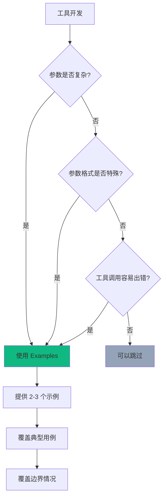

# 工具开发指南

本指南介绍如何开发高质量的 aster 工具，包括基础接口实现、高级特性（如 InputExamples）以及最佳实践。

## 📐 核心接口

### Tool 接口

每个工具必须实现 `tools.Tool` 接口：

```go
// pkg/tools/tool.go
type Tool interface {
    // Name 返回工具名称（全局唯一）
    Name() string

    // Description 返回工具描述（供 LLM 理解工具用途）
    Description() string

    // InputSchema 返回输入参数的 JSON Schema
    InputSchema() map[string]interface{}

    // Execute 执行工具逻辑
    Execute(ctx context.Context, input map[string]interface{}, tc *ToolContext) (interface{}, error)

    // Prompt 返回额外的提示信息（可选，返回空字符串表示无额外提示）
    Prompt() string
}
```

### ExampleableTool 接口（可选）

实现此接口可以为工具提供使用示例，显著提升 LLM 的工具调用准确率：

```go
// pkg/tools/example.go
type ExampleableTool interface {
    Tool
    // Examples 返回工具使用示例列表
    Examples() []ToolExample
}

// ToolExample 定义一个工具使用示例
type ToolExample struct {
    Description string                 // 示例描述
    Input       map[string]interface{} // 输入参数
    Output      interface{}            // 期望输出（可选）
}
```

> **性能提升**: 根据 Anthropic 的测试，提供 InputExamples 可以将工具调用准确率从 72% 提升到 90%。

## 🚀 快速开始

### 步骤 1: 创建工具结构

```go
package mytools

import (
    "context"
    "fmt"

    "github.com/astercloud/aster/pkg/tools"
)

// CalculatorTool 简单计算器工具
type CalculatorTool struct {
    precision int // 小数精度
}

// NewCalculatorTool 工具工厂函数
func NewCalculatorTool(config map[string]interface{}) (tools.Tool, error) {
    precision := 2 // 默认精度
    if p, ok := config["precision"].(int); ok {
        precision = p
    }
    return &CalculatorTool{precision: precision}, nil
}
```

### 步骤 2: 实现 Tool 接口

```go
func (t *CalculatorTool) Name() string {
    return "Calculator"
}

func (t *CalculatorTool) Description() string {
    return "Perform mathematical calculations. Supports basic operations: add, subtract, multiply, divide."
}

func (t *CalculatorTool) InputSchema() map[string]interface{} {
    return map[string]interface{}{
        "type": "object",
        "properties": map[string]interface{}{
            "operation": map[string]interface{}{
                "type":        "string",
                "enum":        []string{"add", "subtract", "multiply", "divide"},
                "description": "The operation to perform",
            },
            "a": map[string]interface{}{
                "type":        "number",
                "description": "First operand",
            },
            "b": map[string]interface{}{
                "type":        "number",
                "description": "Second operand",
            },
        },
        "required": []string{"operation", "a", "b"},
    }
}

func (t *CalculatorTool) Prompt() string {
    return "" // 无额外提示
}

func (t *CalculatorTool) Execute(ctx context.Context, input map[string]interface{}, tc *tools.ToolContext) (interface{}, error) {
    // 1. 解析参数
    operation, ok := input["operation"].(string)
    if !ok {
        return nil, fmt.Errorf("operation must be a string")
    }

    a, ok := input["a"].(float64)
    if !ok {
        return nil, fmt.Errorf("a must be a number")
    }

    b, ok := input["b"].(float64)
    if !ok {
        return nil, fmt.Errorf("b must be a number")
    }

    // 2. 执行计算
    var result float64
    switch operation {
    case "add":
        result = a + b
    case "subtract":
        result = a - b
    case "multiply":
        result = a * b
    case "divide":
        if b == 0 {
            return nil, fmt.Errorf("division by zero")
        }
        result = a / b
    default:
        return nil, fmt.Errorf("unknown operation: %s", operation)
    }

    // 3. 返回结构化结果
    return map[string]interface{}{
        "operation": operation,
        "a":         a,
        "b":         b,
        "result":    result,
    }, nil
}
```

### 步骤 3: 添加使用示例（推荐）

实现 `ExampleableTool` 接口来提供使用示例：

```go
// Examples 返回工具使用示例
func (t *CalculatorTool) Examples() []tools.ToolExample {
    return []tools.ToolExample{
        {
            Description: "Add two numbers",
            Input: map[string]interface{}{
                "operation": "add",
                "a":         10,
                "b":         5,
            },
            Output: map[string]interface{}{
                "operation": "add",
                "a":         10,
                "b":         5,
                "result":    15,
            },
        },
        {
            Description: "Divide with decimal result",
            Input: map[string]interface{}{
                "operation": "divide",
                "a":         7,
                "b":         3,
            },
            Output: map[string]interface{}{
                "operation": "divide",
                "a":         7,
                "b":         3,
                "result":    2.3333333333333335,
            },
        },
    }
}
```

### 步骤 4: 注册工具

```go
package main

import (
    "github.com/astercloud/aster/pkg/tools"
    "your-project/mytools"
)

func main() {
    // 创建工具注册表
    toolRegistry := tools.NewRegistry()

    // 注册工具
    toolRegistry.Register("Calculator", mytools.NewCalculatorTool)

    // 在 Agent 模板中声明使用
    templateRegistry.Register(&types.AgentTemplateDefinition{
        ID:    "math-assistant",
        Tools: []interface{}{"Calculator"},
        // ...
    })
}
```

## 🎨 InputExamples 最佳实践

### 何时使用 Examples



### 示例数量建议

| 工具复杂度 | 建议示例数 | 说明 |
|-----------|----------|------|
| 简单工具 | 1-2 个 | 一个典型用例即可 |
| 中等复杂 | 2-3 个 | 覆盖主要场景 |
| 复杂工具 | 3-5 个 | 包含边界情况 |

### 示例质量要求

```go
// ✅ 好的示例
func (t *MyTool) Examples() []tools.ToolExample {
    return []tools.ToolExample{
        {
            // 描述清晰说明用途
            Description: "Create a new user with email validation",
            Input: map[string]interface{}{
                // 使用真实、有意义的值
                "name":  "Alice Johnson",
                "email": "alice@example.com",
                "role":  "admin",
            },
            // 提供完整的输出格式
            Output: map[string]interface{}{
                "id":         "usr_abc123",
                "name":       "Alice Johnson",
                "email":      "alice@example.com",
                "role":       "admin",
                "created_at": "2024-01-15T10:30:00Z",
            },
        },
    }
}

// ❌ 不好的示例
func (t *BadTool) Examples() []tools.ToolExample {
    return []tools.ToolExample{
        {
            Description: "test",           // 描述不清晰
            Input: map[string]interface{}{
                "x": "foo",                // 参数名不清晰
                "y": 123,                  // 值没有实际意义
            },
            // 缺少 Output
        },
    }
}
```

## 📋 完整工具模板

以下是一个功能完整的工具实现模板：

```go
package mytools

import (
    "context"
    "fmt"
    "time"

    "github.com/astercloud/aster/pkg/tools"
)

// MyTool 工具描述
type MyTool struct {
    config MyToolConfig
}

type MyToolConfig struct {
    Timeout   time.Duration
    MaxRetry  int
    APIKey    string
}

// NewMyTool 创建工具实例
func NewMyTool(config map[string]interface{}) (tools.Tool, error) {
    // 1. 解析并验证配置
    timeout := 30 * time.Second
    if t, ok := config["timeout"].(int); ok {
        timeout = time.Duration(t) * time.Second
    }

    maxRetry := 3
    if r, ok := config["max_retry"].(int); ok {
        maxRetry = r
    }

    apiKey, ok := config["api_key"].(string)
    if !ok || apiKey == "" {
        return nil, fmt.Errorf("api_key is required")
    }

    return &MyTool{
        config: MyToolConfig{
            Timeout:  timeout,
            MaxRetry: maxRetry,
            APIKey:   apiKey,
        },
    }, nil
}

// Name 工具名称
func (t *MyTool) Name() string {
    return "MyTool"
}

// Description 工具描述
func (t *MyTool) Description() string {
    return `Detailed description of what the tool does.

Key features:
- Feature 1
- Feature 2
- Feature 3

Use this tool when you need to...`
}

// InputSchema 输入参数 Schema
func (t *MyTool) InputSchema() map[string]interface{} {
    return map[string]interface{}{
        "type": "object",
        "properties": map[string]interface{}{
            "required_param": map[string]interface{}{
                "type":        "string",
                "description": "A required parameter",
            },
            "optional_param": map[string]interface{}{
                "type":        "integer",
                "description": "An optional parameter with default value",
                "default":     10,
            },
            "enum_param": map[string]interface{}{
                "type":        "string",
                "enum":        []string{"option1", "option2", "option3"},
                "description": "Choose one of the available options",
            },
        },
        "required": []string{"required_param"},
    }
}

// Prompt 额外提示信息
func (t *MyTool) Prompt() string {
    return `Additional guidance for using this tool:
- Always provide required_param
- Use option1 for most cases
- Check the output format before proceeding`
}

// Execute 执行工具
func (t *MyTool) Execute(ctx context.Context, input map[string]interface{}, tc *tools.ToolContext) (interface{}, error) {
    // 1. 参数验证
    requiredParam, ok := input["required_param"].(string)
    if !ok {
        return nil, fmt.Errorf("required_param must be a string")
    }

    optionalParam := 10 // 默认值
    if v, ok := input["optional_param"].(float64); ok {
        optionalParam = int(v)
    }

    // 2. 上下文检查
    select {
    case <-ctx.Done():
        return nil, ctx.Err()
    default:
    }

    // 3. 执行业务逻辑
    result, err := t.doWork(ctx, requiredParam, optionalParam)
    if err != nil {
        return nil, fmt.Errorf("failed to execute: %w", err)
    }

    // 4. 返回结构化结果
    return map[string]interface{}{
        "success":   true,
        "data":      result,
        "timestamp": time.Now().Format(time.RFC3339),
    }, nil
}

// Examples 使用示例（实现 ExampleableTool 接口）
func (t *MyTool) Examples() []tools.ToolExample {
    return []tools.ToolExample{
        {
            Description: "Basic usage with required parameter only",
            Input: map[string]interface{}{
                "required_param": "example_value",
            },
            Output: map[string]interface{}{
                "success":   true,
                "data":      "processed: example_value",
                "timestamp": "2024-01-15T10:30:00Z",
            },
        },
        {
            Description: "Full usage with all parameters",
            Input: map[string]interface{}{
                "required_param": "example_value",
                "optional_param": 20,
                "enum_param":     "option2",
            },
            Output: map[string]interface{}{
                "success":   true,
                "data":      "processed: example_value (option2, limit: 20)",
                "timestamp": "2024-01-15T10:30:00Z",
            },
        },
    }
}

// doWork 内部业务逻辑
func (t *MyTool) doWork(ctx context.Context, param string, limit int) (string, error) {
    // 实现具体业务逻辑
    return fmt.Sprintf("processed: %s (limit: %d)", param, limit), nil
}
```

## 🧪 测试工具

### 单元测试模板

```go
package mytools_test

import (
    "context"
    "testing"

    "github.com/astercloud/aster/pkg/tools"
    "your-project/mytools"
)

func TestMyTool_Execute(t *testing.T) {
    // 1. 创建工具
    tool, err := mytools.NewMyTool(map[string]interface{}{
        "api_key": "test-key",
    })
    if err != nil {
        t.Fatalf("Failed to create tool: %v", err)
    }

    // 2. 准备测试用例
    tests := []struct {
        name    string
        input   map[string]interface{}
        wantErr bool
    }{
        {
            name: "valid input",
            input: map[string]interface{}{
                "required_param": "test",
            },
            wantErr: false,
        },
        {
            name:    "missing required param",
            input:   map[string]interface{}{},
            wantErr: true,
        },
        {
            name: "invalid param type",
            input: map[string]interface{}{
                "required_param": 123, // 应该是 string
            },
            wantErr: true,
        },
    }

    // 3. 执行测试
    for _, tt := range tests {
        t.Run(tt.name, func(t *testing.T) {
            ctx := context.Background()
            tc := &tools.ToolContext{}

            result, err := tool.Execute(ctx, tt.input, tc)

            if tt.wantErr && err == nil {
                t.Error("expected error, got nil")
            }
            if !tt.wantErr && err != nil {
                t.Errorf("unexpected error: %v", err)
            }
            if !tt.wantErr && result == nil {
                t.Error("expected result, got nil")
            }
        })
    }
}

func TestMyTool_Examples(t *testing.T) {
    tool, _ := mytools.NewMyTool(map[string]interface{}{
        "api_key": "test-key",
    })

    // 检查是否实现了 ExampleableTool 接口
    exampleTool, ok := tool.(tools.ExampleableTool)
    if !ok {
        t.Skip("Tool does not implement ExampleableTool")
    }

    examples := exampleTool.Examples()
    if len(examples) == 0 {
        t.Error("expected at least one example")
    }

    // 验证每个示例都可以成功执行
    ctx := context.Background()
    tc := &tools.ToolContext{}

    for i, ex := range examples {
        t.Run(ex.Description, func(t *testing.T) {
            _, err := tool.Execute(ctx, ex.Input, tc)
            if err != nil {
                t.Errorf("example %d failed: %v", i, err)
            }
        })
    }
}
```

## ✅ 开发检查清单

开发工具时，请确保满足以下要求：

### 基础要求

- [ ] 工具名称唯一且有意义
- [ ] Description 清晰描述工具用途
- [ ] InputSchema 完整定义所有参数
- [ ] 所有必需参数标记在 `required` 中
- [ ] Execute 正确处理所有参数类型

### 错误处理

- [ ] 验证所有输入参数
- [ ] 处理参数类型错误
- [ ] 处理业务逻辑错误
- [ ] 使用 `fmt.Errorf` 包装错误，提供上下文
- [ ] 检查 context 取消

### 返回值

- [ ] 返回结构化数据（map 或 struct）
- [ ] 包含足够的信息供 LLM 理解
- [ ] 错误时返回有用的错误信息

### Examples（推荐）

- [ ] 提供 2-3 个典型使用示例
- [ ] 示例描述清晰明了
- [ ] 示例输入值真实有意义
- [ ] 示例输出与实际一致

### 测试

- [ ] 单元测试覆盖主要场景
- [ ] 测试参数验证
- [ ] 测试错误处理
- [ ] 测试 Examples 可执行

## 🔗 相关资源

- [内置工具参考](./1.builtin.md) - 查看内置工具实现
- [自定义工具](./3.custom.md) - 更多自定义工具示例
- [MCP 集成](../3.mcp/overview.md) - 集成外部工具
- [Tool 接口 API](/api-reference/tools) - 完整 API 文档
