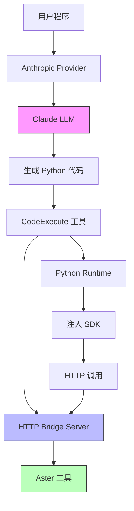
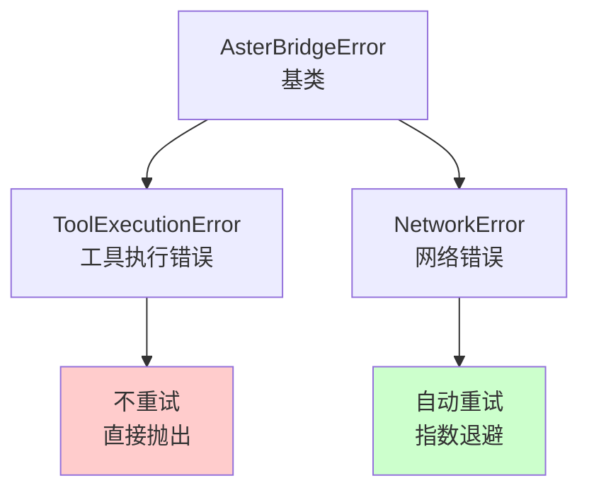
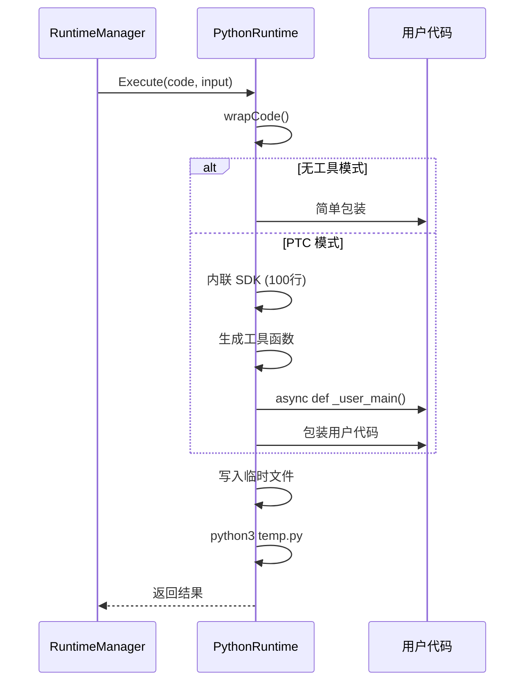
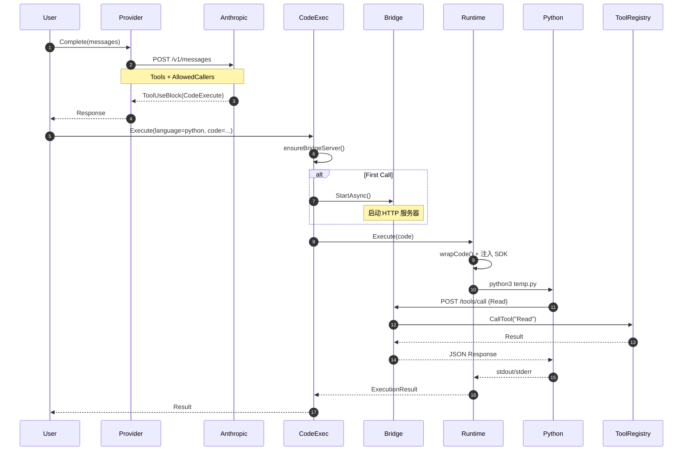
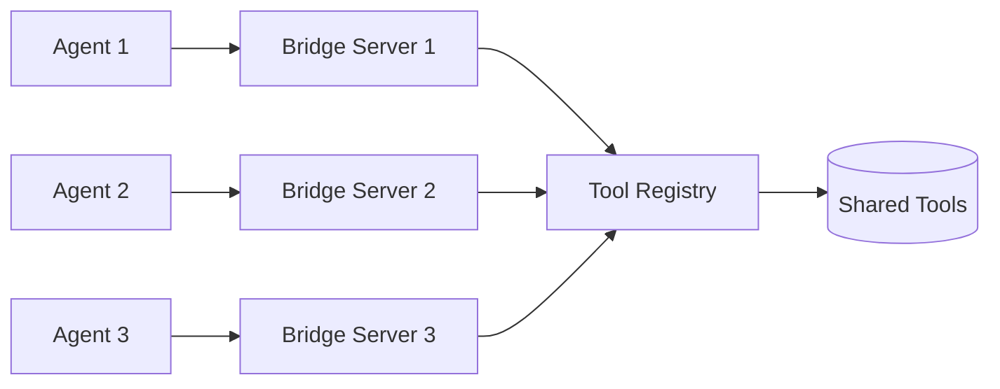

# PTC 架构设计

## 整体架构



## 核心组件

### 1. 协议扩展

#### ToolSchema 扩展

```go
type ToolSchema struct {
    Name        string
    Description string
    InputSchema map[string]any

    // PTC 扩展
    AllowedCallers []string `json:"allowed_callers,omitempty"`
}
```

**字段说明:**
- `AllowedCallers`: 指定工具可调用的上下文
  - `"direct"`: LLM 直接调用
  - `"code_execution_20250825"`: Python 代码中调用

#### ToolUseBlock 扩展

```go
type ToolUseBlock struct {
    ID     string
    Name   string
    Input  map[string]any

    // PTC 扩展
    Caller *ToolCaller `json:"caller,omitempty"`
}

type ToolCaller struct {
    Type   string  // "direct" | "code_execution_20250825"
    ToolID string  // CodeExecute 工具的 ID
}
```

### 2. HTTP 桥接服务器

::code-group
```go [服务器实现]
type HTTPBridgeServer struct {
    bridge *ToolBridge
    server *http.Server

    // 性能优化
    schemaCache *schemaCache
}

func NewHTTPBridgeServer(bridge *ToolBridge, addr string) *HTTPBridgeServer {
    return &HTTPBridgeServer{
        bridge: bridge,
        server: &http.Server{
            Addr:         addr,
            ReadTimeout:  30 * time.Second,
            WriteTimeout: 30 * time.Second,
            IdleTimeout:  120 * time.Second,  // Keep-Alive
        },
        schemaCache: newSchemaCache(5 * time.Minute),
    }
}
```

```go [端点实现]
// POST /tools/call
func (s *HTTPBridgeServer) handleToolCall(w http.ResponseWriter, r *http.Request) {
    var req ToolCallRequest
    json.NewDecoder(r.Body).Decode(&req)

    // 获取工具上下文
    tc := s.getToolContext()

    // 调用工具
    result, _ := s.bridge.CallTool(ctx, req.Tool, req.Input, tc)

    // 返回结果
    s.sendJSON(w, &ToolCallResponse{
        Success: result.Success,
        Result:  result.Result,
        Error:   result.Error,
    })
}
```
::

**API 端点:**

| 端点 | 方法 | 功能 | 缓存 |
|------|------|------|------|
| `/tools/call` | POST | 调用工具 | ❌ |
| `/tools/list` | GET | 列出工具 | ✅ |
| `/tools/schema` | GET | 获取 Schema | ✅ 5分钟 |
| `/health` | GET | 健康检查 | ❌ |

### 3. Python SDK

#### 核心类设计

```python
class AsterBridge:
    def __init__(self, base_url, max_retries=3, retry_delay=0.5):
        self.base_url = base_url
        self.max_retries = max_retries
        self.retry_delay = retry_delay
        self._session = None

    async def call_tool(self, name: str, **kwargs) -> Any:
        # 重试逻辑
        for attempt in range(self.max_retries):
            try:
                # HTTP 调用
                async with session.post(...) as resp:
                    result = await resp.json()
                    return result["result"]
            except aiohttp.ClientConnectorError:
                # 网络错误: 重试
                if attempt < self.max_retries - 1:
                    await asyncio.sleep(self.retry_delay * (2 ** attempt))
                    continue
                raise
            except ToolExecutionError:
                # 工具错误: 不重试
                raise
```

#### 错误层次



### 4. 运行时集成

#### 代码注入流程



#### 生成代码结构

```python
# 1. 导入 (5行)
import json, asyncio, aiohttp, sys, os

# 2. 异常类 (10行)
class _ToolExecutionError(Exception): pass
class _NetworkError(Exception): pass

# 3. 桥接类 (80行)
class _AsterBridge:
    # 完整实现包含重试逻辑

# 4. 初始化 (5行)
_bridge = _AsterBridge("http://localhost:8080")

# 5. 工具函数生成 (10行)
for _tool_name in ["Read", "Write", ...]:
    globals()[_tool_name] = _create_tool_function(_bridge, _tool_name)

# 6. 用户代码包装 (5行 + 用户代码)
async def _user_main():
    # [用户代码]
    files = await Glob(pattern="*.go")

# 7. 运行 (5行)
if __name__ == "__main__":
    asyncio.run(_user_main())
    asyncio.run(_bridge.close())
```

**代码大小分析:**
- SDK 基础代码: ~100 行
- 用户代码: 可变
- 总代码: ~100 + 用户代码行数

### 5. 数据流

#### 完整调用链



## 性能优化

### 1. 连接复用

```go
// HTTP 服务器配置
server := &http.Server{
    IdleTimeout: 120 * time.Second,  // Keep-Alive 2分钟
}

// Python SDK
class AsterBridge:
    async def _get_session(self):
        # 复用同一个 aiohttp.ClientSession
        if self._session is None or self._session.closed:
            self._session = aiohttp.ClientSession()
        return self._session
```

**优势:**
- 减少 TCP 握手开销
- 降低延迟 (1-2ms → 0.5ms)
- 提升吞吐量 (2x)

### 2. Schema 缓存

```go
type schemaCache struct {
    entries map[string]*cacheEntry
    ttl     time.Duration
    mu      sync.RWMutex
}

func (c *schemaCache) get(key string) (any, bool) {
    c.mu.RLock()
    defer c.mu.RUnlock()

    entry, ok := c.entries[key]
    if !ok || time.Since(entry.timestamp) > c.ttl {
        return nil, false
    }
    return entry.data, true
}
```

**性能提升:**
- Schema 查询: O(n) → O(1)
- 延迟降低: 10ms → 0.1ms
- CPU 使用: 减少 90%

### 3. 并发控制

```python
# 限制并发数避免资源耗尽
sem = asyncio.Semaphore(10)

async def call_with_limit(tool, **kwargs):
    async with sem:
        return await tool(**kwargs)

# 批量调用
results = await asyncio.gather(
    *[call_with_limit(Read, path=f) for f in files]
)
```

## 安全设计

### 1. 沙箱隔离

```go
// 代码执行在受控环境中
config := &RuntimeConfig{
    WorkDir:   "/tmp/sandbox",  // 隔离目录
    MaxOutput: 1 * 1024 * 1024, // 限制输出 1MB
    Timeout:   30 * time.Second, // 超时保护
}
```

### 2. 网络隔离

```go
// HTTP 服务器仅监听本地
server := &http.Server{
    Addr: "localhost:8080",  // 不对外暴露
}
```

### 3. 权限控制

```go
// AllowedCallers 精确控制
toolSchemas := []ToolSchema{
    {
        Name: "Read",
        AllowedCallers: []string{"direct", "code_execution_20250825"},
    },
    {
        Name: "Bash",
        AllowedCallers: []string{"direct"},  // 危险工具禁止 PTC
    },
}
```

## 扩展性

### 多语言支持

当前架构可以轻松扩展支持其他语言:

```go
// Node.js Runtime (未来)
type NodeJSRuntime struct {
    config *RuntimeConfig
}

func (r *NodeJSRuntime) wrapCode(code string) string {
    return fmt.Sprintf(`
const axios = require('axios');

async function Read(params) {
    const res = await axios.post('http://localhost:8080/tools/call', {
        tool: 'Read',
        input: params
    });
    return res.data.result;
}

%s
`, code)
}
```

### 分布式部署



## 监控指标

### 关键指标

| 指标 | 说明 | 目标值 |
|------|------|--------|
| 服务器启动时间 | HTTP 服务器就绪 | < 100ms |
| 工具调用延迟 | 单次调用耗时 | < 10ms |
| Python 冷启动 | 首次执行耗时 | < 100ms |
| Python 热执行 | 后续执行耗时 | < 20ms |
| 内存占用 | 空闲状态 | < 10MB |
| QPS | 并发吞吐量 | > 20/s |

### 监控实现

```go
type Metrics struct {
    ToolCalls     prometheus.Counter
    CallLatency   prometheus.Histogram
    ActiveSessions prometheus.Gauge
}

// 记录指标
start := time.Now()
result, _ := bridge.CallTool(ctx, name, input, tc)
metrics.CallLatency.Observe(time.Since(start).Seconds())
metrics.ToolCalls.Inc()
```

## 参考实现

完整源代码位置:

```
pkg/tools/bridge/
├── http_server.go      # HTTP 桥接服务器
├── runtime.go          # Python 运行时
├── tool_bridge.go      # 工具桥接
└── ptc_integration_test.go  # 集成测试

client-sdks/python-bridge/
└── aster.py            # Python SDK

pkg/tools/builtin/
└── codeexecute.go      # CodeExecute 工具

pkg/provider/
└── anthropic.go        # Anthropic 适配
```
